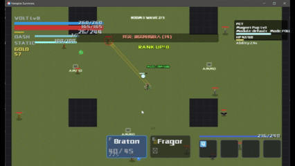
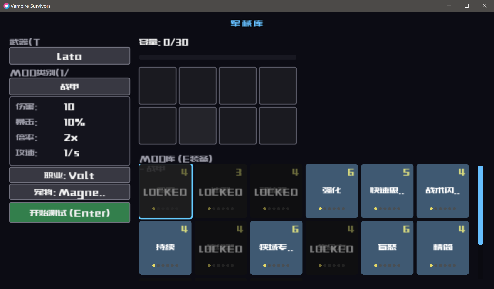
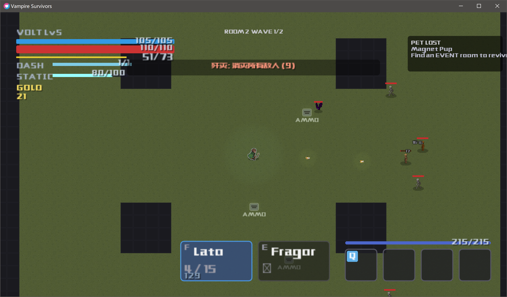

# 🎮 Vampire: Warframe-Inspired 2D Roguelite Shooter

<p align="center">
  <strong>一款融合 Warframe 机制与 Hades 流程的 2D 俯视角射击游戏</strong>
</p>

<p align="center">
  
</p>

## 📸 游戏截图

<p align="center">
  
  
</p>

---

## 📖 项目简介

**Vampire** 是一款使用 LÖVE 2D 引擎（Lua）开发的 2D 俯视角 Roguelite 射击游戏。这是一个**个人学习项目**，游戏灵感来源于：
- **Warframe** — MOD 增强系统、伤害计算机制、战甲与武器设计
- **Hades** — 房间流程、随机升级选择、快节奏战斗
- **Vampire Survivors** — 弹幕射击、经验升级、生存玩法

玩家操控战甲（Warframe），使用多种武器和技能，在随机生成的房间中击败敌人、收集 MOD、不断强化自己。

> [!NOTE]
> 本项目仍在积极开发中，部分功能可能尚未完善。

---

## 核心特性

### 战斗系统
- **13 种武器**：步枪、霰弹枪、狙击枪、弓箭、手枪、能量武器、近战武器
- **完整弹道系统**：弹药管理、换弹机制、暴击、穿透、元素伤害
- **4 技能系统**：每个战甲拥有独特的主动技能

### MOD 系统（Warframe 风格）
- **8 槽位装配**：每件装备可装配 8 个 MOD
- **3 类 MOD**：战甲 MOD、武器 MOD、伴侣 MOD
- **50 种 MOD 卡**：伤害、暴击、元素、生存等多种增益

### 敌人与战斗
- **18 种敌人类型**：骷髅、蝙蝠、植物弹幕、冲锋者、盾牌兵、重机枪手、狙击手、炮手、钩爪蝎子、治疗者、自爆者、无效化者等
- **Warframe 伤害类型**：切割、穿刺、冲击 + 火焰、冰冻、电击、毒素元素组合
- **攻击预警系统**：敌人攻击前有明确的视觉提示

### 房间进度系统
- **Hades 风格关卡流**：清理房间 → 选择奖励 → 进入下一房间
- **任务类型**：歼灭、防御、生存三种玩法
- **Boss 战**：阶段性大型 Boss 挑战（树人 Treant）

### 渲染与视效
- **自定义渲染管线**：后期处理、Bloom 效果
- **VFX 系统**：粒子特效、拖尾效果
- **中文字体支持**：完整的中文 UI 界面

---

## 技术栈

| 类别 | 技术 |
|------|------|
| **游戏引擎** | LÖVE 2D 11.4 |
| **编程语言** | Lua 5.1 (LuaJIT) |
| **架构设计** | 数据驱动、模块化、状态管理 |
| **代码规模** | 131 个 Lua 模块 |

---

## 快速开始

### 环境要求
- [LÖVE 11.4](https://love2d.org/) 或更高版本

### 运行游戏

**方法一：命令行**
```bash
# 克隆仓库
git clone https://github.com/your-username/vampire.git
cd vampire

# 使用 LÖVE 运行
love .
```

**方法二：拖放运行**
1. 下载并安装 LÖVE
2. 将项目文件夹拖拽到 `love.exe` 上

---

## 操作指南

| 按键 | 功能 |
|------|------|
| `W A S D` | 移动 |
| `鼠标左键` | 射击 / 攻击 |
| `鼠标右键` | 瞄准（狙击枪） |
| `空格` | 闪避 |
| `Ctrl` | 战术冲刺 |
| `1 2 3 4` | 释放技能 |
| `R` | 换弹 |
| `Tab` | 游戏内菜单 |
| `Q` | 切换武器 |

---

## 项目结构

```
Vampire/
├── main.lua              # 游戏入口
├── conf.lua              # LÖVE 配置
├── core/                 # 核心系统
│   ├── state.lua         # 全局状态管理
│   ├── arsenal.lua       # 装备系统
│   └── input.lua         # 输入处理
├── gameplay/             # 游戏玩法
│   ├── player.lua        # 玩家逻辑
│   ├── weapons.lua       # 武器系统
│   ├── enemies.lua       # 敌人 AI
│   └── abilities.lua     # 技能系统
├── systems/              # 游戏系统
│   ├── mods.lua          # MOD 系统
│   ├── progression.lua   # 进度系统
│   └── analytics.lua     # 数据分析
├── ui/                   # 用户界面
│   ├── screens/          # 各个界面
│   └── widgets/          # UI 组件
├── render/               # 渲染系统
│   ├── draw.lua          # 绘制逻辑
│   ├── pipeline.lua      # 渲染管线
│   └── vfx.lua           # 视觉特效
├── data/defs/            # 数据定义
│   ├── catalog/          # 武器、增强定义
│   ├── enemies.lua       # 敌人定义
│   └── mods/             # MOD 定义
├── world/                # 世界系统
│   └── rooms.lua         # 房间生成
├── docs/                 # 设计文档
└── assets/               # 资源文件
    ├── characters/       # 角色动画
    ├── weapons/          # 武器图标
    └── sfx/              # 音效
```

---

## 开发者工具

| 快捷键 | 功能 |
|--------|------|
| `F1` | 打开 Debug 菜单 |
| `F2` | 切换 FPS 显示 |
| `F5` | 返回军械库（调试） |

---

## 项目亮点

### 1. 完整的系统架构
- **模块化设计**：131 个独立模块，职责清晰
- **数据驱动**：武器、敌人、MOD 等全部通过配置文件定义
- **状态管理**：统一的 `state.lua` 管理游戏状态

### 2. Warframe 机制复刻
- **8 槽 MOD 系统**：完整还原 Warframe 的 MOD 装配机制
- **伤害计算**：基础伤害 → MOD 加成 → 暴击 → 元素 → 护甲减免
- **战甲系统**：3 种战甲（Excalibur / Mag / Volt），各有独特属性

### 3. 自定义 UI 框架
- **Widget 系统**：按钮、滑块、槽位、面板等可复用组件
- **响应式设计**：支持窗口缩放
- **中文渲染**：集成自定义中文字体

### 4. 渲染管线
- **后期处理**：Bloom、色彩校正
- **特效系统**：粒子、拖尾、屏幕震动

---

## 设计文档

详细的设计规范请参阅 `docs/` 目录：

- [游戏尺度设计规范](docs/GAME_SCALE_DESIGN.md) — 定义所有实体、空间、时间参数
- [视觉风格指南](docs/VISUAL_STYLE_GUIDE_TEMPLATE.md) — 美术风格和配色
- [渲染管线实现](docs/RENDER_PIPELINE_IMPLEMENTATION_STEPS.md) — 后期处理技术

---

## 开发路线图

- [x] 核心战斗系统
- [x] MOD 装配系统
- [x] 房间进度流程
- [x] UI 框架
- [x] 存档系统
- [ ] 完整 Boss 战
- [ ] 新手教程
- [ ] 更多武器内容
- [ ] 音效完善
- [ ] 跨平台打包

---

## License

MIT License

---

## 致谢

- [LÖVE](https://love2d.org/) — 优秀的 2D 游戏引擎
- [Warframe](https://www.warframe.com/) — MOD 系统设计灵感
- [Hades](https://www.supergiantgames.com/games/hades/) — 房间流程设计灵感

---

